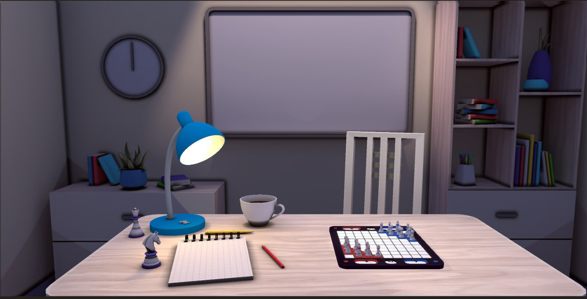
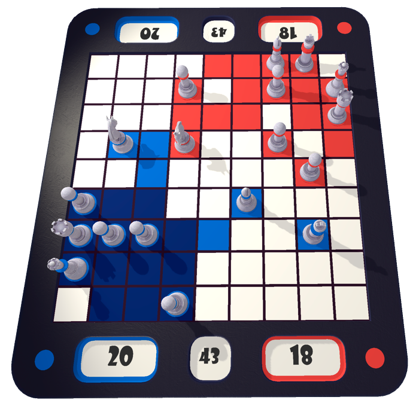
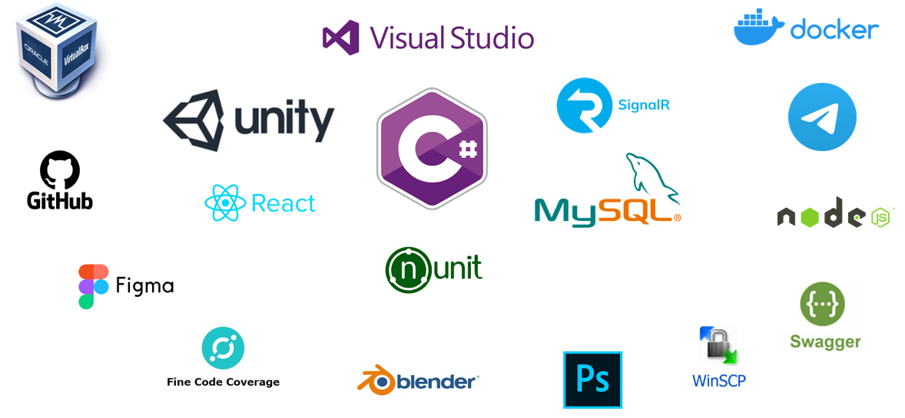

# ColorChess

## Описание



### ColorChess - шахматно-подобная игра с новыми игровыми механиками. Суть игры - захватить как можно больше территории. Игроки ходят по очереди своими фигурами до тех пор, пока на игровой доске не останется свободных клеток.



### При контроле территории размером 3 на 3, она становится захваченной, это значит, что соперники больше не смогут наступить на эту территорию!

## Структура проекта

Проект состоит из нескольких модулей:

1. ColorChessModel - ядро системы, в котором заключена основная логика игры и её алгоритмы
2. Unity - графическая составляющая
3. GameServer - игровой сервер
4. ReportBotTelegram - система для создания отчётов
5. Site - веб-сайт, на котором можно скачать игру
6. UnitTestColorChess - юнит-тесты покрывающие функционал ядра системы

В проекте используется множество инструментов и технологий, основными являются Unity, SignalR, MySQL, Docker



## Подготовка к запуску

1. Изменить значение IP в ColorChess\Server\ConfigServer.cs

2. Скомпилировать ColorChessModel

3. Собрать приложение в Unity под PC и Android

4. Поместить файл BuildPC.zip и BuildAndroid.apk в Site/public/Files

5. Создать файл .env

   ```
   DOCKER_NAME = name_example
   PASSWORD = password_example
   MYSQL_ROOT_PASSWORD = password_example
   MYSQL_DATABASE = name_example
   MYSQL_USER = name_example
   MYSQL_PASSWORD = password_example
   ```

## Запуск проекта (Docker)

1. Скачать файл docker-compose.yml, docker_update_linux.sh и docker_update_windows.ps1

2. Загрузить приложение на DockerHub, пример скрипта для Windows в файле docker_update_windows.ps1, команда для запуска:
   ```
   docker_update_windows.ps1
   ```
3. Обновить образ с DockerHub и запустить его, пример скрипта для Linux в файле docker_update_linux.sh, команда для запуска
   ```
   sudo bash docker_update_linux.sh
   ```

## Запуск проекта (Скрипт)

В качестве примера в папке scripts находятся 5 файлов:

1. getIp - получения IP компьютера и сохранения в файл
2. startGameServer - компиляция и запуск игрового сервера
3. StartSite - сборка и запуск сайта
4. StartTelegramBot - компиляция и запуск телеграмм-бота
5. updateGit - обновления проекта с GitHub

Для запуска нужно запустить только updateGit

```
sudo bash updateGit.sh
```
